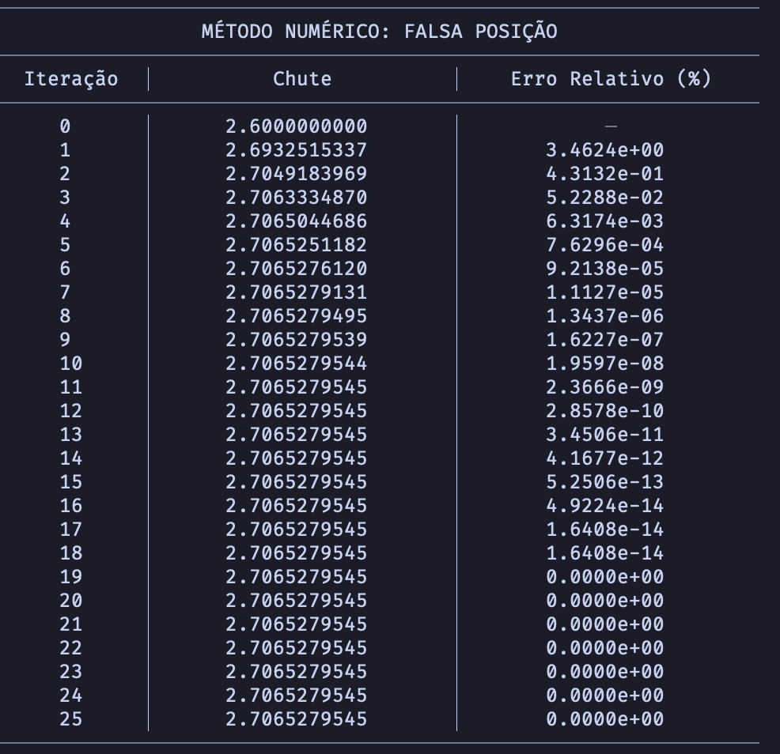
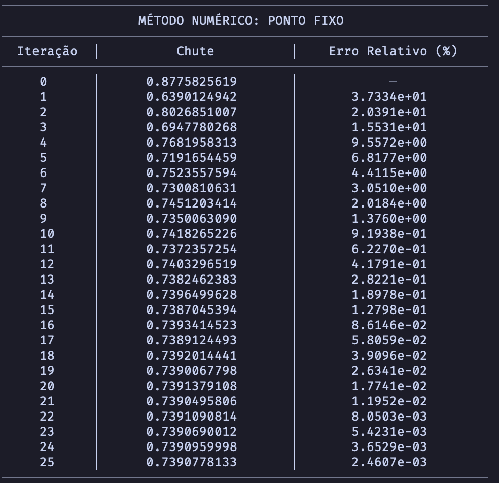
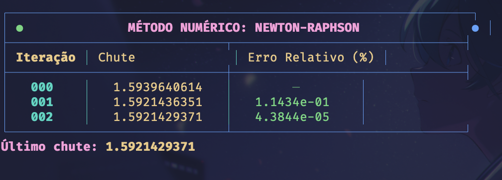
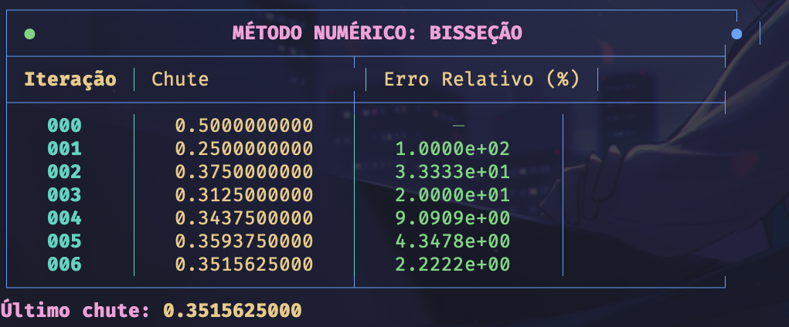
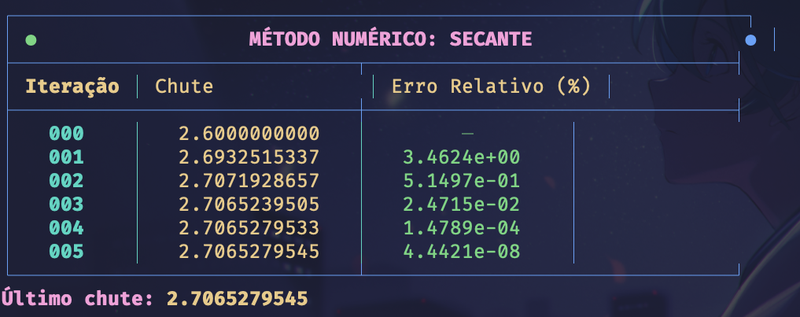

# Implementação de métodos numéricos

## Descrição

Este repositório contém a implementação de 5 métodos numéricos em Python, desenvolvidos para encontrar raízes de equações. Cada método foi projetado com foco na precisão e eficiência, utilizando apenas bibliotecas padrão do Python. Dados adicionais foram gerados em CSV para que estudos complementares possam serem desenvolvidos. 

## Métodos implementados:
- Falsa posição
- Ponto fixo
- Newton-Raphson
- Bisseção
- Secante

## Funcionamento

## Comparação de desempenho

## Comparação de convergência

